PASO 1: Creación de la estructura de las máquinas virtuales + ip --SIN PROVISIONS--

1. He creado la estructura principal de las máquinas virtuales y les he puesto la ip correspondiente a cada una
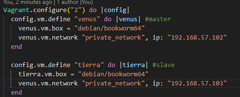

------------------------------------------------------------------------------------

PASO 2: Instalación de bind9 y copia de sus archivos a modificar en mi repositorio

1. He añadido la provision de bind9 en el codigo y he copiado los archivos a modificar en una carpeta "files"
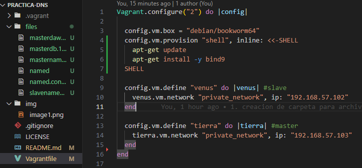

------------------------------------------------------------------------------------

PASO 3: Modificación de los archivos de configuración para que:
1. El servidor solo escuche al protocolo IPv4.
    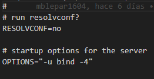

2. Se establezca la opción de dnssec-validation a yes.
3. Los servidores permitan las consultas recursivas a solamente a los ordenadores de la red 127.0.0.0/8 y en la red 192.168.57.0/24 usando la opción acl.
    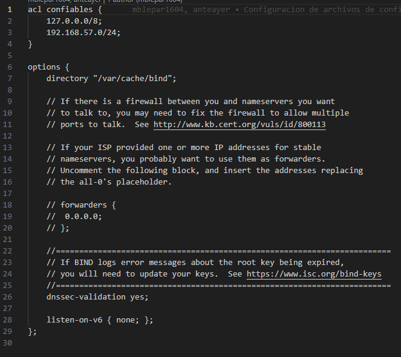

4. El servidor maestro sea tierra.sistema.test y tenga autoridad sobre la zona directa e inversa.
    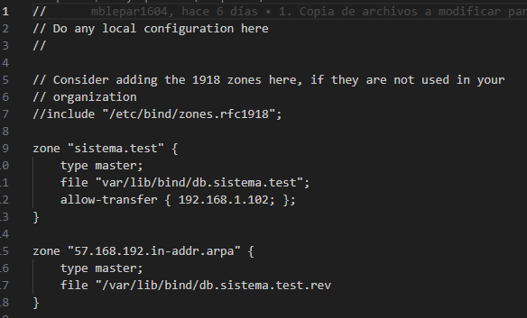
    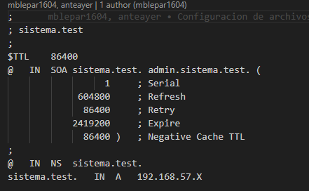
    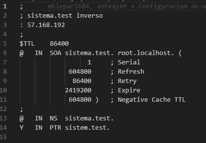

5. El servidor esclavo sea venus.sistema.test y su maestro sea tierra.sistema.test.
    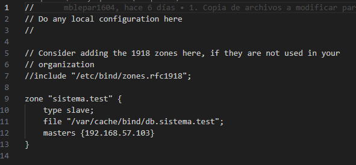

------------------------------------------------------------------------------------

PASO 4: Segunda modificación de archivos de configuración para que:
1. El tiempo de caché de las respuestas negativas sea de 2 horas.
2. Las consultas no autorizadas sean reenviadas al servidor de OpenDNS
3. Se configuren los alias:
    · ns1.sistema.test para tierra
    · ns2.sistema.test para venus
    · mail.sistema.test para marte
4. El equipo de marte.sistema.test actue como servidor de correo del dominio
5. Reajustes varios en archivos que podrían dar error
    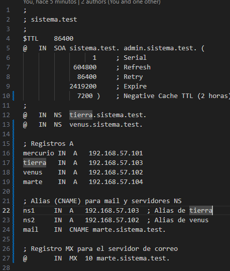
    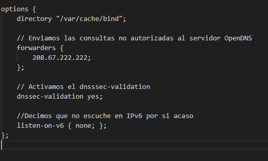

------------------------------------------------------------------------------------

RESOLUCIÓN DE ERRORES:

1. Se ha extraído de la máquina virtual el archivo resolv.conf para su modificacion
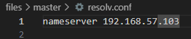 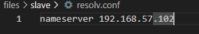

2. Se han corregido errores de escritura de los archivos de configuración

------------------------------------------------------------------------------------

COMPROBACIÓN DE FUNCIONAMIENTO:

1. Puedes resolver los registros tipo A
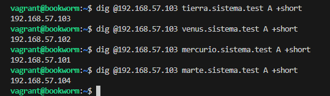

2. Comprueba que se pueden resolver de forma inversa sus direcciones IP.
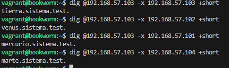

3. Puedes resolver los alias ns1.sistema.test y ns2.sistema.test.
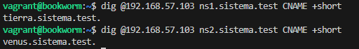

4. Realiza la consulta para saber los servidores MX de sistema.test
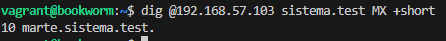

5. Comprueba que se ha realizado la transferencia de la zona entre el servidor DNS maestro y el
esclavo. Revisa los logs o realiza una consulta del registro AXFR.
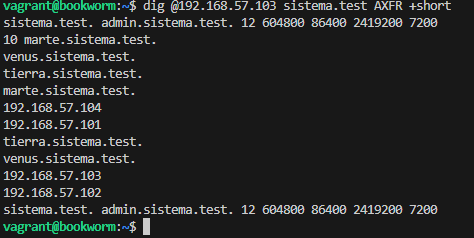

6. Comprueba que tanto maestro como esclavo pueden contestar a las mismas preguntas.
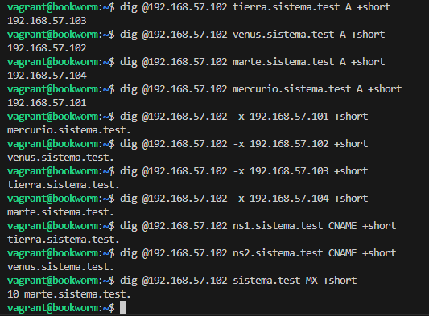

7. Comprobacion mediante archivo test.sh
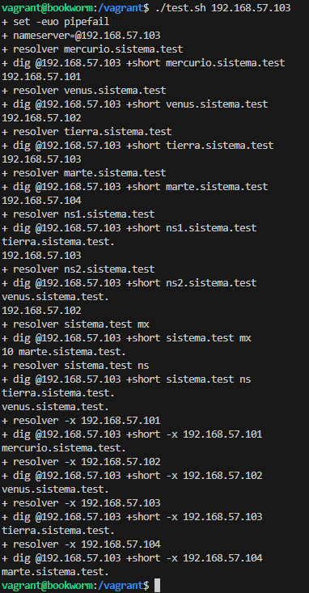